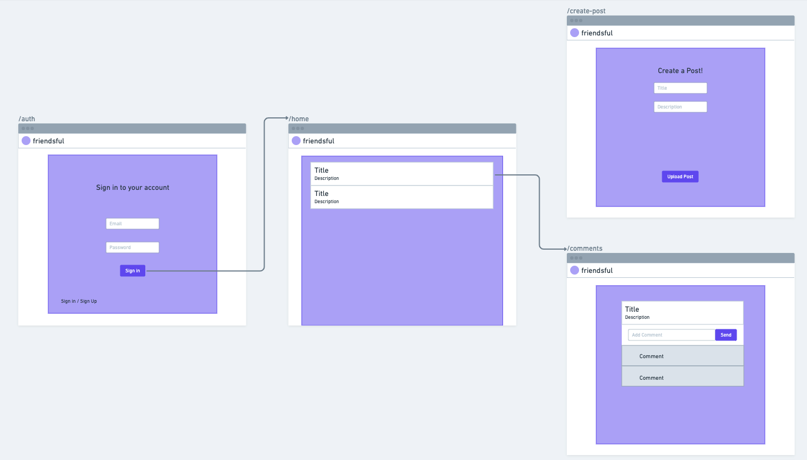

# Realtime Group App

Use [this template](https://github.com/alchemycodelab/web-template-supabase) for this deliverable.

**Build something with supabase realtime in a group**

## Groups

Work in groups of 2-3 for this assignment.

-   This means one code base (supabase and githubrepo)
    -   one person creates and then gives permissions to the other people
-   You can divvy up features, and/or pair or mob
-   When pairing or mobbing, you **must** switch "drivers" (person writing code) at regular intervals (25 or 30 minutes). Google "pomodoro" for online web timers
-   The "navigator" (person not writing code) typically leads
-   Consciously allow each other to:
    -   Speak
    -   Ideate
    -   Lead

## Supabase

-   Create a new supabase project
-   Turn on email authentication, but no email confirmation

## Requirements

Base requirements:

-   Authenticated users (comes with template)
-   Use realtime functionality (single chat room okay)
-   Need a suggestion? Social media feed with Image upload capabilities

Stretch requirements:

-   User profiles
-   Favorites or Reactions
-   Multiple views of the data (all, my, favorites)

## Rubric

The following is required for your assignment to be graded:

-   **Must be a group project (no solo)**
-   PR open from `dev` to `main`
-   PR Passes CI (lint + tests)
-   PR preview on netlify

| Commits with Working Features... | Points |
| -------------------------------- | ------ |
| WEB module "standard" app        | 10     |
| Use of realtime                  | 10     |
